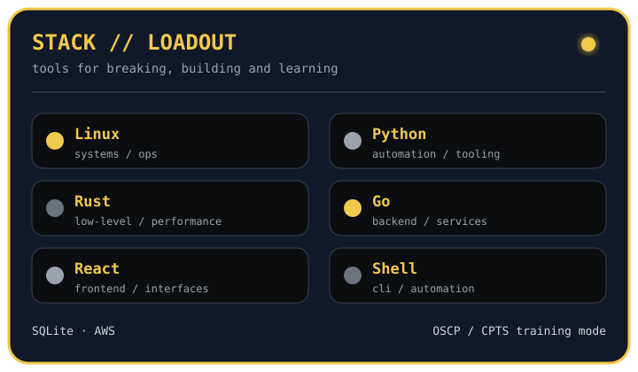
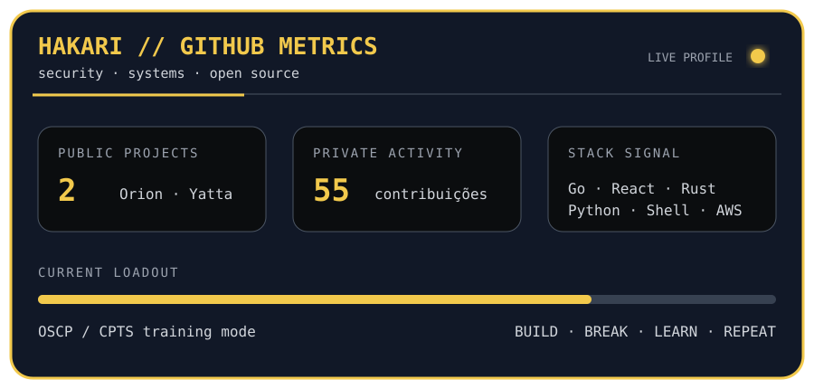
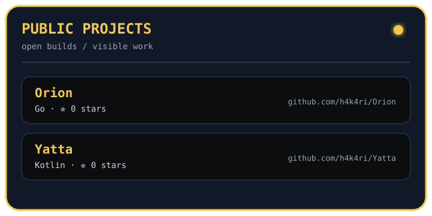
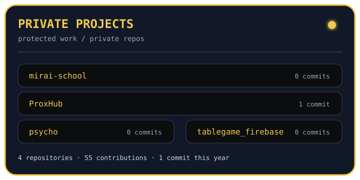

  

  <h3>🟡 segurança ofensiva · automação · low-level</h3>
  
build · break · learn · repeat

  
  

## 🌙 Sobre mim

Sou curioso, gosto de desmontar sistemas e compartilhar projetos que acho interessantes. Não prometo *clean code* perfeito — prometo aprender e melhorar a cada commit. 💀

- 🎯 Estudando para **OSCP** e **CPTS**
- 🛡️ Segurança ofensiva, sistemas e automação
- 🧪 Ferramentas e projetos open source

## 🧰 Stack

  

## 🔒 Contribuições privadas

<!-- PRIVATE_COMMITS:START -->
> **1 commit** em repositórios privados em 2026 · **55 contribuições privadas**
>
> Atualizado em 05/10/2026.
<!-- PRIVATE_COMMITS:END -->

Totais agregados, atualizados automaticamente pelo GitHub Actions.

## ✨ GitHub metrics

  

Card gerado localmente pelo GitHub Actions, com calendário, atividade, linguagens e projetos.

## 🗃️ Project cards

<table align="center">
  <tr>
    <td width="50%"></td>
    <td width="50%"></td>
  </tr>
</table>

Os projetos privados aparecem sem links públicos.

  <i>「 何度でも、立ち上がる。 」 — levantar quantas vezes forem necessárias.</i>

